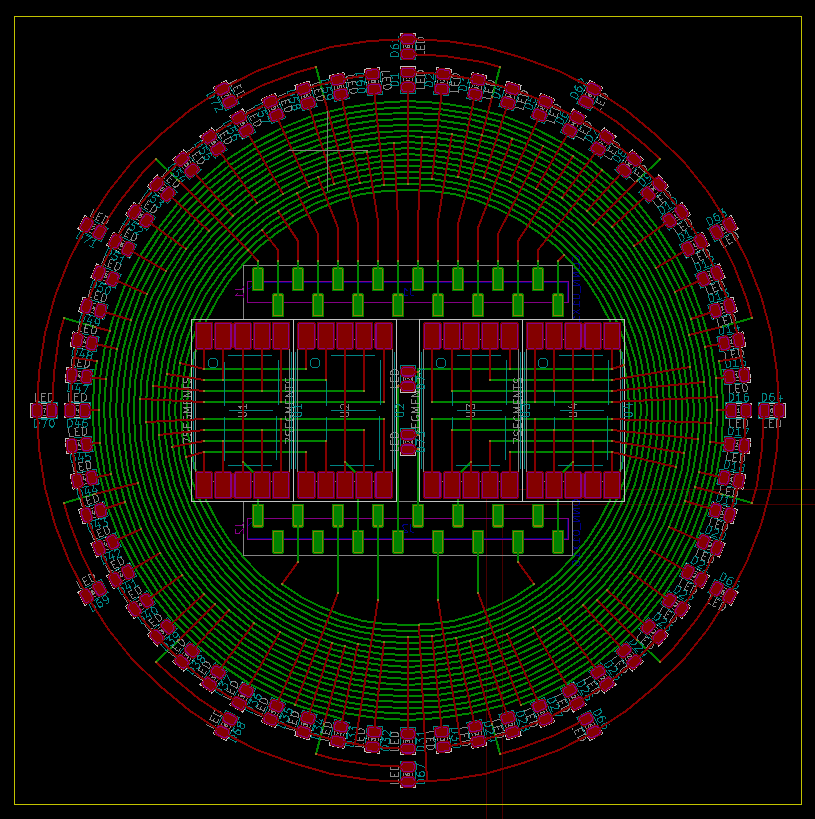

# KiCad - Studio Clock

## Python Scripting Example: Studio Clock

This project shows how to fully script and parametrize the creation of a analog studio clock with LED minute and hour points and 7 Segment digits in the center.

This is the revival of the code i posted in a quite popular post in the KiCad forums:

https://forum.kicad.info/t/python-scripting-example-studio-clock/5387

Since the original code was rather anti-pythonic and difficult to read and understand, I first ported it to Python 3 and reformatted it with the black formatter to improve it step by step. The result is a completely new code that shares only the logic with the original. The originally uploaded Python2 code can be found in the first commit of this repository.

Note: StudioClock-rescue.lib is needed for the old 7 Segment Symbol.
